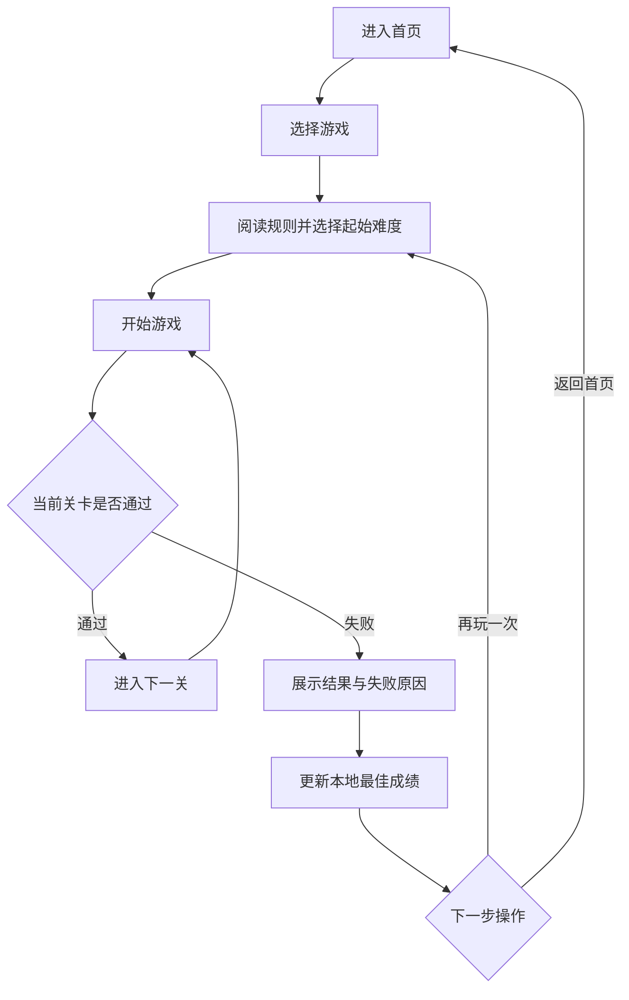

# 舒尔特类认知训练小游戏网站 PRD

## 1. 产品概述
本项目是一个面向注意力、短时记忆、空间定位与反应控制训练的认知小游戏网站，首期包含黑猩猩测试、数字记忆、序列记忆、视觉记忆四个可独立游玩的训练模块。

- 目标用户：普通训练用户、挑战型用户、高阶难度用户。
- 核心价值：提供 1 到 3 分钟即可完成的轻量训练体验，并通过起始难度选择和本地最佳成绩让用户持续挑战。

## 2. 核心功能

### 2.1 功能模块
1. **首页**：产品介绍、四个游戏入口、能力标签、历史最佳概览。
2. **黑猩猩测试**：数字位置记忆、点击后隐藏数字、按 1 到 N 顺序点击。
3. **数字记忆**：展示随机数字、隐藏后输入复现、保留前导 0。
4. **序列记忆**：九宫格亮灯播放、用户按相同顺序点击复现。
5. **视觉记忆**：短暂展示目标格子、隐藏后点击所有目标格子。
6. **结果反馈**：展示本轮成绩、失败原因、是否刷新历史最佳，并支持重玩、调整难度、返回首页。

### 2.2 页面详情
| 页面名称 | 模块名称 | 功能说明 |
|---|---|---|
| 首页 | 顶部导航 | 展示 Logo、首页入口、游戏列表入口、最佳成绩入口 |
| 首页 | 游戏卡片 | 展示游戏名称、简介、训练能力标签、历史最佳成绩 |
| 首页 | 最佳成绩概览 | 从 localStorage 读取四个游戏的历史最好成绩 |
| 黑猩猩测试页 | 规则说明 | 说明数字位置记忆与顺序点击规则 |
| 黑猩猩测试页 | 起始难度 | 支持选择起始关卡 1 到 17，对应 4 到 20 个数字 |
| 黑猩猩测试页 | 游戏区域 | 随机摆放数字，点击 1 后隐藏其余数字文本 |
| 数字记忆页 | 起始难度 | 支持选择起始位数 3 到 20 |
| 数字记忆页 | 展示与输入 | 展示数字和倒计时，结束后自动进入输入状态 |
| 序列记忆页 | 起始难度 | 支持选择起始序列长度 1 到 30 |
| 序列记忆页 | 九宫格 | 播放高亮序列，播放期间禁用输入 |
| 视觉记忆页 | 起始难度 | 支持选择起始关卡 1 到 20 |
| 视觉记忆页 | 网格记忆 | 按关卡生成 3x3 到 6x6 网格和目标格子 |
| 游戏页 | 结果弹窗 | 展示最高关卡、得分、正确率或失败答案，并提供下一步操作 |

## 3. 核心流程
用户进入首页后选择游戏，在游戏说明页选择起始难度并开始；系统按所选难度初始化游戏。用户通关后进入下一关，失败后展示结果弹窗，并把最佳成绩保存到本地。

## 4. 游戏规则

### 4.1 黑猩猩测试
- 当前关卡生成 N 个数字，数字为 1 到 N，随机分布且不重叠。
- 用户点击数字 1 后，其他未点击数字隐藏为统一方块。
- 用户必须按升序点击，点错即失败，全部点对进入下一关。
- 起始关卡默认 1，可选 1 到 17；第 1 关为 4 个数字，最高 20 个数字。

### 4.2 数字记忆
- 当前关卡生成长度为 N 的随机数字字符串，首位允许为 0。
- 数字展示时长为 `max(1200ms, N * 450ms)`。
- 展示结束后进入输入状态，用户提交的字符串必须完全一致。
- 起始位数默认 3，可选 3 到 20；通过后位数加 1。

### 4.3 序列记忆
- 使用固定 3x3 网格，系统生成长度为 N 的随机格子序列，同一格允许重复。
- 系统按顺序高亮格子，播放期间禁用用户点击。
- 用户按相同顺序点击，任一步错误即失败，完整复现后进入下一关。
- 起始序列长度默认 1，可选 1 到 30。

### 4.4 视觉记忆
- 系统按关卡生成网格和目标格子，目标格子不可重复。
- 目标格子短暂高亮后隐藏，用户点击记住的目标格子。
- 点中全部目标通过，点击非目标格子立即失败。
- 起始关卡默认 1，可选 1 到 20；网格规模从 3x3 增长到 6x6。

## 5. 数据与本地存储
- 使用 `localStorage` 保存每个游戏的历史最佳成绩。
- 存储键：`cognitive-games-best-scores`。
- 每条记录包含：`gameId`、`bestLevel`、`bestScore`、`bestAccuracy`、`updatedAt`。
- 刷新页面后仍应展示历史最佳成绩。

## 6. 通用状态机
| 状态 | 说明 | 允许操作 |
|---|---|---|
| intro | 规则说明与起始难度选择 | 调整难度、开始游戏、返回首页 |
| ready | 游戏已初始化 | 开始、返回 |
| showing | 系统展示记忆内容 | 通常不允许输入 |
| input | 用户输入或点击 | 提交、点击、重置当前输入 |
| success | 当前关卡通过 | 继续下一关 |
| failed | 当前关卡失败 | 查看结果、重玩、调整难度 |
| result | 展示本轮最终成绩 | 再玩一次、回首页、切换游戏 |

## 7. 用户界面设计

### 7.1 设计风格
- 整体风格：轻科技、清爽训练工具感，强调游戏区域和即时反馈。
- 色彩方向：浅色背景，深蓝作为主色，荧光青或暖橙作为反馈强调色。
- 布局：桌面优先，最大内容宽度 960px，首页使用卡片网格，游戏页聚焦单一任务。
- 按钮：圆角胶囊按钮，点击时提供 80 到 150ms 的轻量反馈。
- 字体：使用具有数字可读性的标题字体与舒适正文搭配，避免过度装饰影响游戏判断。

### 7.2 页面设计概览
| 页面名称 | 模块名称 | UI 元素 |
|---|---|---|
| 首页 | Hero | 训练主题文案、开始入口、轻量背景网格纹理 |
| 首页 | 游戏卡片 | 游戏图标、能力标签、最佳成绩、悬停抬升效果 |
| 游戏页 | 顶部状态 | 返回首页、游戏名、当前关卡、最好成绩 |
| 游戏页 | 难度选择 | 滑杆、加减按钮、当前值说明 |
| 游戏页 | 游戏区域 | 自适应网格、明确的成功/失败/禁用状态 |
| 游戏页 | 结果弹窗 | 成绩摘要、最佳刷新提示、操作按钮 |

### 7.3 响应式与可访问性
- 桌面端游戏区域居中，移动端优先保证格子不横向溢出。
- 按钮和格子点击区域不小于 44px。
- 状态反馈必须结合颜色、文案和形态，不能只依赖颜色。
- 支持 Tab 聚焦按钮，Enter 提交数字记忆答案。

## 8. 验收标准
- 首页展示四个游戏入口，点击后进入对应游戏页。
- 每个游戏都有规则说明与起始难度选择器。
- 每个游戏按用户选择的起始难度初始化，不强制从最低难度开始。
- 四个游戏的失败、通关、下一关、本地最佳成绩逻辑正确。
- 数字记忆不丢失前导 0。
- 展示阶段点击或输入不应产生有效操作。
- 桌面端和移动端均可正常游玩，无关键元素溢出。
