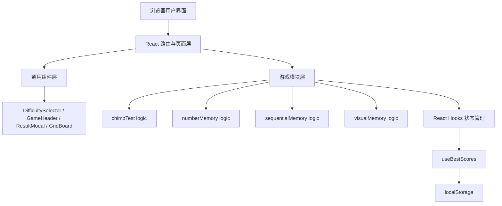
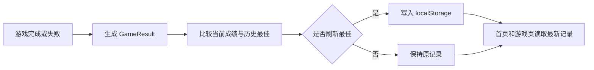

# 舒尔特类认知训练小游戏网站技术架构

## 1. 架构设计
项目采用纯前端单页应用架构，不依赖后端服务。页面路由、游戏状态、随机生成、成绩存储都在浏览器端完成，历史最佳成绩通过 `localStorage` 持久化。



## 2. 技术说明
- 前端：React 18 + TypeScript + Vite。
- 样式：原生 CSS + CSS 变量，避免为首期引入额外样式框架。
- 路由：React Router，支持首页和四个游戏路径。
- 状态管理：React hooks，本期不引入 Redux、Zustand 等全局状态库。
- 数据持久化：浏览器 `localStorage`。
- 后端：无。
- 数据库：无。
- 测试与校验：使用 TypeScript 类型检查和 Vite 构建校验。

## 3. 路由定义
| 路由 | 用途 |
|---|---|
| `/` | 首页，展示产品介绍、游戏入口、历史最佳概览 |
| `/games/chimp-test` | 黑猩猩测试游戏页 |
| `/games/number-memory` | 数字记忆游戏页 |
| `/games/sequential-memory` | 序列记忆游戏页 |
| `/games/visual-memory` | 视觉记忆游戏页 |
| `*` | 兜底返回首页或展示轻量 404 |

## 4. 目录结构
```text
src/
  components/
    DifficultySelector.tsx
    GameCard.tsx
    GameHeader.tsx
    GridBoard.tsx
    ResultModal.tsx
  data/
    games.ts
  games/
    chimpTest/
      ChimpTestGame.tsx
      logic.ts
    numberMemory/
      NumberMemoryGame.tsx
      logic.ts
    sequentialMemory/
      SequentialMemoryGame.tsx
      logic.ts
    visualMemory/
      VisualMemoryGame.tsx
      logic.ts
  hooks/
    useBestScores.ts
    useTimeout.ts
  pages/
    HomePage.tsx
  types/
    game.ts
  utils/
    random.ts
    storage.ts
  App.tsx
  main.tsx
  styles.css
```

## 5. 核心类型
```typescript
export type GameId =
  | 'chimp-test'
  | 'number-memory'
  | 'sequential-memory'
  | 'visual-memory';

export type GameStatus =
  | 'intro'
  | 'ready'
  | 'showing'
  | 'input'
  | 'success'
  | 'failed'
  | 'result';

export type GameConfig = {
  id: GameId;
  name: string;
  description: string;
  abilityTags: string[];
  defaultStartLevel: number;
  minStartLevel: number;
  maxStartLevel: number;
  bestScoreLabel: string;
};

export type BestScore = {
  gameId: GameId;
  bestLevel: number;
  bestScore: number;
  bestAccuracy?: number;
  updatedAt: number;
};

export type GameResult = {
  gameId: GameId;
  title: string;
  bestLevel: number;
  score: number;
  accuracy?: number;
  detail?: string;
  isNewBest: boolean;
};
```

## 6. 数据模型

### 6.1 本地存储结构
```typescript
const STORAGE_KEY = 'cognitive-games-best-scores';

type BestScoreMap = Partial<Record<GameId, BestScore>>;
```

### 6.2 数据流


## 7. 游戏模块设计

### 7.1 黑猩猩测试
- `logic.ts` 负责生成不重叠数字位置，输入为数字数量和游戏区域约束。
- 组件状态包含：`items`、`nextExpectedNumber`、`hidden`、`currentLevel`、`status`。
- 点击 1 后设置 `hidden = true`，后续只展示方块位置。

### 7.2 数字记忆
- `logic.ts` 负责生成指定长度数字字符串，始终返回 string。
- 组件状态包含：`targetNumber`、`userInput`、`currentDigits`、`status`。
- 展示计时结束后自动聚焦输入框，提交时做字符串完全匹配。

### 7.3 序列记忆
- `logic.ts` 负责生成指定长度序列，格子索引范围为 0 到 8，允许重复。
- 组件状态包含：`sequence`、`activeCell`、`playbackIndex`、`inputIndex`、`status`。
- 播放期间禁用点击，输入阶段逐步校验。

### 7.4 视觉记忆
- `logic.ts` 负责根据关卡计算网格规模、目标数量、预览时长，并生成不重复目标。
- 组件状态包含：`targets`、`selectedCells`、`gridSize`、`status`。
- 预览结束后隐藏目标，点击非目标立即失败。

## 8. API 定义
本项目首期无后端 API。所有数据均由前端运行时生成，并通过浏览器本地存储保存。

## 9. 边界与质量要求
- 难度选择低于最小值或高于最大值时必须自动钳制到合法范围。
- 展示阶段点击不应产生有效输入。
- 快速连续点击不能重复进入下一关或重复写入结果。
- 数字记忆答案不能转为 number，避免前导 0 丢失。
- 游戏逻辑应拆到各自 `logic.ts`，避免把四个游戏逻辑集中在 `App.tsx`。
- 移动端网格自适应视口宽度，点击目标不小于 44px。

## 10. 构建与运行
```bash
npm install
npm run dev
npm run build
```

## 11. 后续扩展
- 可增加统计页，展示最近游玩记录和趋势。
- 可增加深色模式。
- 可增加更多认知训练游戏，只需新增游戏配置、路由、组件和独立逻辑模块。
